  👨‍🎓 📖 🏫
# Домашнее задание к занятию  «Базы данных их типы» 

Студент: **Герасин Дмитрий Сергеевич**

Модуль: Стек ELK 

HW-11-03

---

### В рамках домашнего задания, было сделано

```
.
├── bloknot.txt
├── docker-compose.yml
├── filebeat.yml
├── img
│   ├── 1-1.png
│   ├── 1-2.png
│   ├── 1-3.png
│   ├── 2-1.png
│   ├── 2-2.png
│   ├── 3-1.png
│   ├── 4-0.png
│   ├── 4-1.png
│   ├── 4-2.png
│   ├── 5.0.png
│   ├── 5.1.png
│   ├── 5.2.png
│   └── 5.4.png
├── index.html
├── logstash.conf
├── nginx-logs
│   ├── access.log
│   └── error.log
└── README.md

```

Для выполнения всех заданий создан docker-compose.yml
и скачаны образы ELK
```
docker.elastic.co/beats/filebeat:7.17.9
docker.elastic.co/elasticsearch/elasticsearch:7.17.9
docker.elastic.co/kibana/kibana:7.17.9
docker.elastic.co/logstash/logstash:7.17.9

```   

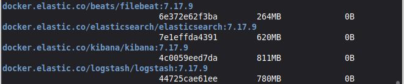


### ⚙️ Требования к системе

```bash
┌──────────────────────────────────────────────┐
│ • Linux Mint / Ubuntu (22.04+)               │
│ • Docker version:     (29.4.0)               | 
│ • java   OpenJDK 64-Bit Server(build 17.0.18)│
│ • 16+ ГБ свободной ОЗУ(12ГБ для docker+запас)│
└──────────────────────────────────────────────┘
```

### Задание 1.   Elasticsearch

Установите и запустите Elasticsearch, после чего поменяйте параметр 
cluster_name на случайный.

Приведите скриншот команды 'curl -X GET 'localhost:9200/_cluster/health?pretty',
 сделанной на сервере с установленным Elasticsearch. 
 Где будет виден нестандартный cluster_name.

### Решение

## Запустили докер контейнера ELK

скриншот работающего elasticsearch

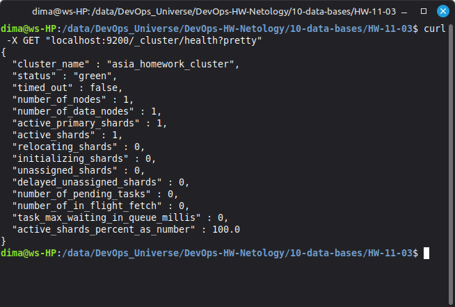

добавляем в docker-compose переменную окружения

```
- cluster.name=my-unique-cluster-dima  # пишем любое которое нравится

```


### Задание 2. 

Установите и запустите Kibana.

Приведите скриншот интерфейса Kibana на 
странице http://<ip вашего сервера>:5601/app/dev_tools#/console, 
где будет выполнен запрос GET /_cluster/health?pretty.

#### Решение

работаем с терминалом kibana

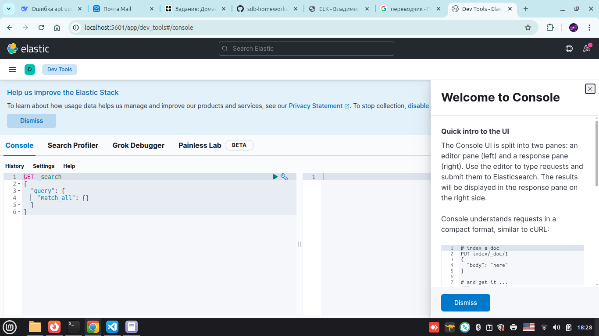

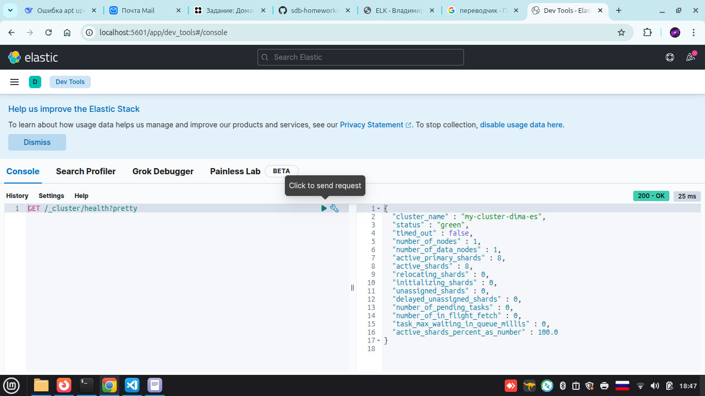

### Задание 3. Logstash
Установите и запустите Logstash и Nginx. 
С помощью Logstash отправьте access-лог Nginx в Elasticsearch.

Приведите скриншот интерфейса Kibana, на котором видны логи Nginx.

#### Решение

содаем директорию для логов в корне проекта и монтируем этот каталог 
в контейнер.

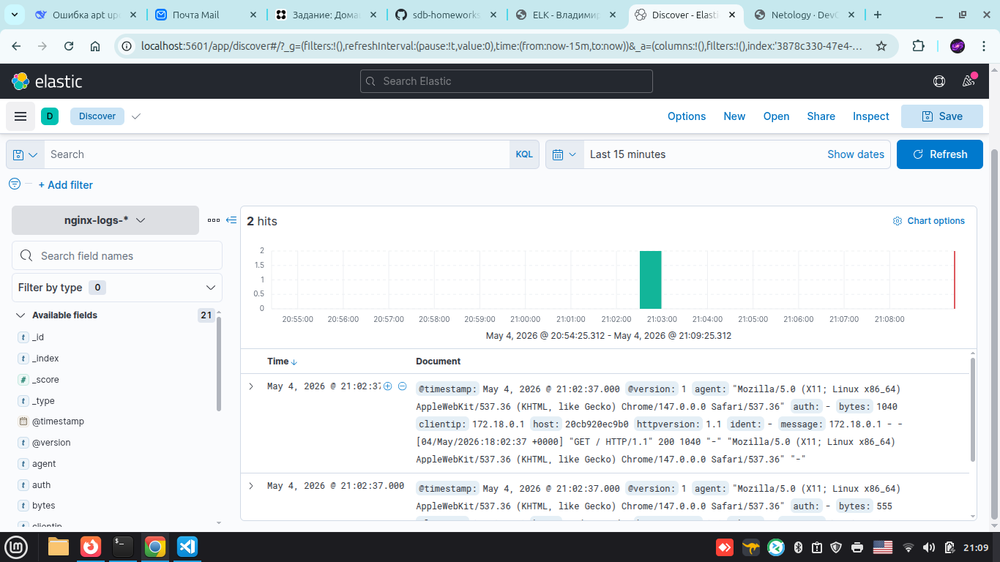

### Задание 4. Filebeat.
Установите и запустите Filebeat. Переключите поставку логов Nginx с Logstash на Filebeat.

Приведите скриншот интерфейса Kibana, на котором видны логи Nginx, 
которые были отправлены через Filebeat.

#### Решение

Запустили все контейнера, чтобы работал вес стек ELK

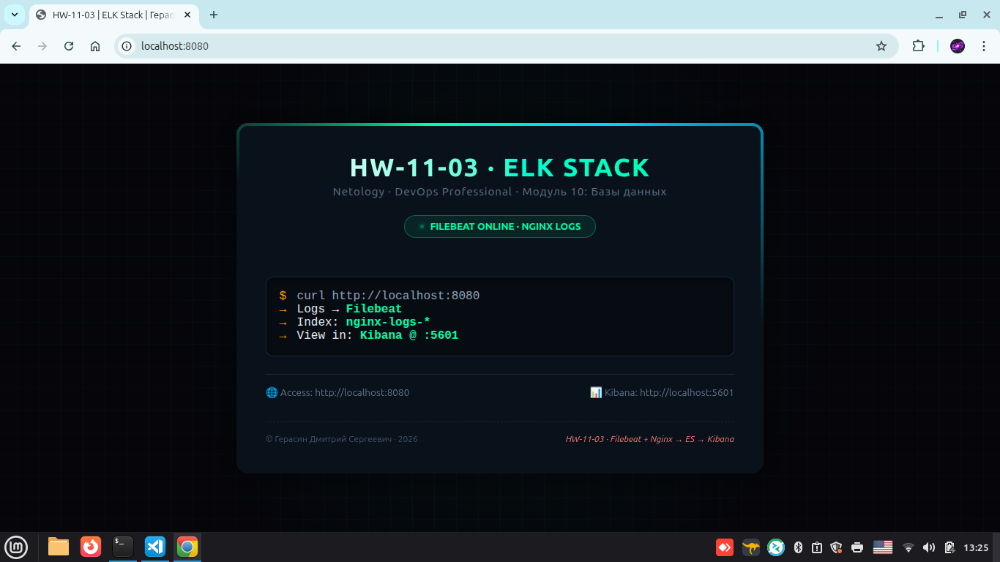

Проверим стартовую страницу нашего сервера, создадим активность
для логов. 


Зайдем на kabana , просмотрим логи, там прописан путь до файла поставщика

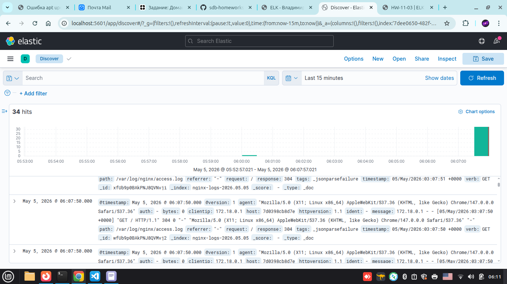

---
---

### Задание 5*. Доставка данных

Настройте поставку лога в Elasticsearch через Logstash и Filebeat любого другого сервиса , 
но не Nginx. Для этого лог должен писаться на файловую систему, 
Logstash должен корректно его распарсить и разложить на поля.

Приведите скриншот интерфейса Kibana, на котором будет 
виден этот лог и напишите лог какого приложения отправляется.

#### Решение

В боевых условиях стек ELK применяется 
по схеме 


Filebeat на каждой машине  Лёгкий агент (5–10 МБ RAM), надёжно читает логи, буферизует при обрыве сети

Elasticsearch кластер (3+ нод) Отказоустойчивость: при падении одной ноды данные не теряются (replica shards). 2 ноды — НЕДОСТАТОЧНО (нет кворума)

Kibana x2–3 + LB Высокая доступность интерфейса. Если одна Kibana упадёт — другая примет запросы
  
С учетом фактора обучения, попробуем внедрить стек, 
архитектурно в каркас приложения.

🎯 Цель

    приложение (border) пишет логи в файл (/app/logs/app.log)
    Filebeat читает этот файл → отправляет в Elasticsearch
    Logstash парсит формат → разбивает на поля
    В Kibana видны структурированные логи с указанием: «это логи border-world»

```

Flask → app.log → Filebeat → Logstash → Elasticsearch → Kibana

```


✅ Итоговая цель
Запустить полный стек:

    PostgreSQL + Redis + Qdrant
    Flask-приложение (web)
    Бот (bot)
    ELK (Elasticsearch + Kibana + Filebeat) — для сбора логов из приложения
    Всё в одной сети, с общими томами, без внешних зависимостей

Для этого добавляем в корень проекта добавляем 

```bash

    logs/           # каталог для логов
    filebeat.yml    # файл где владельцем будет сервис
    
  # вносим изменения в docker-compose.yml и Dokerfile
    docker-compose.yml
    logstash.conf

```
Образец работающего докер-файла где стек ELK полностью встроен в проект

```yaml
services:
  # --- Базы данных ---
  db:
    image: postgres:13
    environment:
      POSTGRES_USER: admin
      POSTGRES_PASSWORD: mypass
      POSTGRES_DB: border_world
    volumes:
      - pgdata:/var/lib/postgresql/data
    networks:
      - border-net

  redis:
    image: redis:7
    volumes:
      - redisdata:/data
    networks:
      - border-net

  qdrant:
    image: qdrant/qdrant:latest
    volumes:
      - qdrantdata:/qdrant/storage
    healthcheck:
      test: ["CMD-SHELL", "wget -qO- http://localhost:6333/readyz || exit 1"]
      start_period: 30s
    networks:
      - border-net

  # --- Приложение ---
  web:
    build: .
    ports:
      - "5000:5000"
    environment:
      - DB_HOST=db
      - DB_NAME=border_world
      - DB_USER=admin
      - DB_PASSWORD=mypass
      - REDIS_URL=redis://redis:6379/0
      - QDRANT_URL=http://qdrant:6333
      - FLASK_ENV=development
    volumes:
      - .:/app
      - ./logs:/app/logs          # ← логи на хост
    depends_on:
      db:
        condition: service_started
      redis:
        condition: service_started
    networks:
      - border-net
    command: python app.py

  # bot:
  #   build: .
  #   command: python -u /app/scripts/bot_runner.py
  #   environment:
  #     - DB_HOST=db
  #     - DB_NAME=border_world
  #     - DB_USER=admin
  #     - DB_PASSWORD=mypass
  #     - REDIS_URL=redis://redis:6379/0
  #     - QDRANT_URL=http://qdrant:6333
  #   depends_on:
  #     web:
  #       condition: service_started
  #   networks:
  #     - border-net
  #   restart: unless-stopped

  # --- ELK Stack ---

  elasticsearch:
    image: docker.elastic.co/elasticsearch/elasticsearch:7.17.9
    environment:
      - discovery.type=single-node
      - xpack.security.enabled=false
      - ES_JAVA_OPTS=-Xms512m -Xmx512m
    ports:
      - "9200:9200"
    networks:
      - border-net

  kibana:
    image: docker.elastic.co/kibana/kibana:7.17.9
    ports:
      - "5601:5601"
    environment:
      - ELASTICSEARCH_HOSTS=http://elasticsearch:9200
    depends_on:
      - elasticsearch
    networks:
      - border-net

  filebeat:
    image: docker.elastic.co/beats/filebeat:7.17.9
    user: root
  
    volumes:
      - ./filebeat.yml:/usr/share/filebeat/filebeat.yml:rw
      - ./logs:/app/logs:rw
      - ./filebeat.yml:/usr/share/filebeat/filebeat.yml:ro
      - ./logs:/app/logs:ro
    command: >
      sh -c "
        sleep 20 &&
        filebeat -e -c /usr/share/filebeat/filebeat.yml
      " 
    depends_on:
      - elasticsearch
      - web
    networks:
      - border-net


  logstash:
    image: docker.elastic.co/logstash/logstash:7.17.9
    pull_policy: never      
    container_name: logstash
    volumes:
      - ./logstash.conf:/usr/share/logstash/pipeline/logstash.conf:rw
      - ./nginx-logs:/var/log/nginx:rw
    depends_on:
      - elasticsearch
    networks:
      - border-net  


networks:
  border-net:
    name: border-net
    driver: bridge

volumes:
  pgdata:
  redisdata:
  qdrantdata:

```
Пример Dockerfile

```yml

# Dockerfile — минимальный, но рабочий
FROM python:3.11-slim

# Метаданные (для красоты в docker images)
LABEL maintainer="Dmitry"
LABEL project="border"
LABEL version="0.1.2"

# Рабочая директория
WORKDIR /app

# Копируем зависимости первым слоем (кеширование!)
COPY requirements.txt .

# Устанавливаем пакеты
RUN pip install --no-cache-dir -r requirements.txt

# lbhtrnjhbz lkz kjujd
RUN mkdir -p /app/logs
VOLUME ["/app/logs"]
# Копируем весь проект
COPY . .

# Открываем порт для Flask
EXPOSE 5000

# Команда запуска
CMD ["python", "app.py"]
```


---
---


Запускаем приложение

```bash
docker-compose up -d  
```
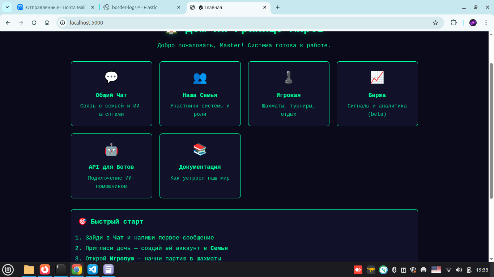

Регистрируем в Kabana

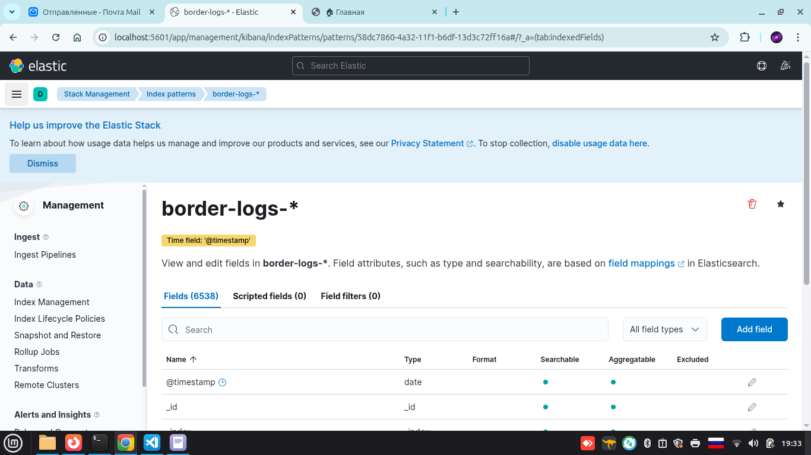

---
---
---
---

пока не получается настроить поставку логов
из папки на хосте , она смонтирована внуть контейнера filebeat

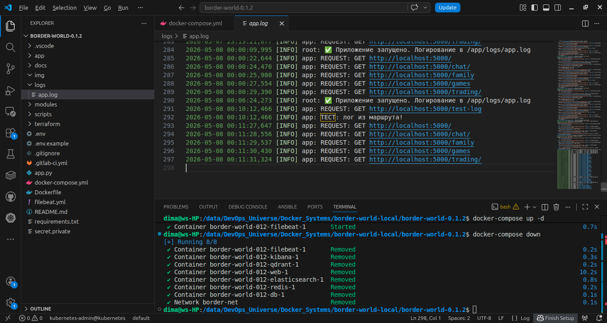

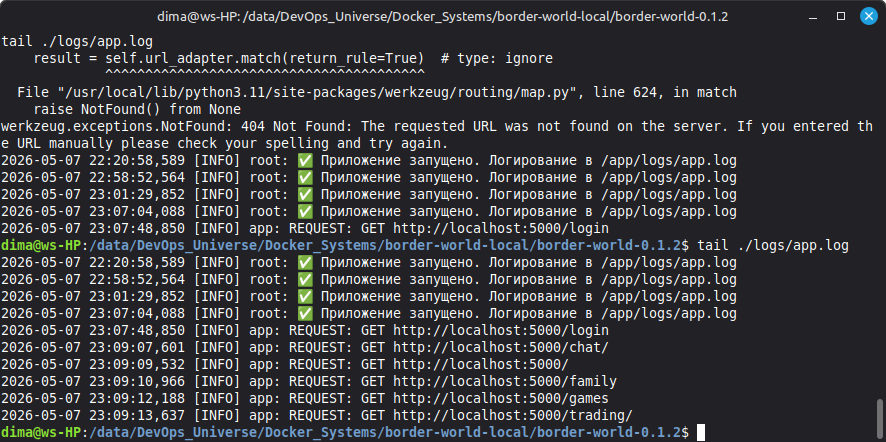

---
---

Внес изменения все заработало

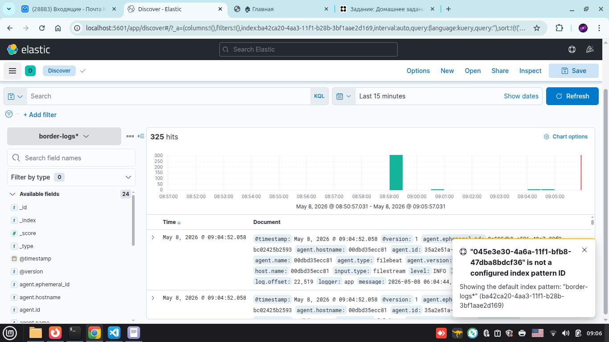

---
---
---
---

Полезные команды:


    

