## 👨‍🎓 📖 🏫

# Домашнее задание к занятию  «Базы данных их типы» 

### Студент: **Герасин Дмитрий Сергеевич**

### Модуль: Системы хранения и передачи данных.

#### RabbitQL

##      HW-11-04

---
---

Архитектура выполненной  домашней работы.

```bash
.
├── ansible-playbook      # плейбук 
├── ansible-role-rabbitmq-cluster    # роль для установки и настройки кластера
├── bloknot.txt                  # заметки , полезные команды
├── img                          # скриншоты к заданиям
├── README.md                    # основной для проверки преподователем
├── scripts                      # скрипты написанные в ходе выполнения работы
└── vms              # виртуальные машины (создание , полезные команды)

```
---

### ⚙️ Требования к системе

```bash
┌──────────────────────────────────────────────┐
│ • Linux Mint / Ubuntu (22.04+)               │
│ • python3     (  3.12.3  )                   | 
│ • jinja version = (  3.1.2  )                |
│ • 8+ ГБ свободной ОЗУ(  3ГБ для vm )         │
| • libyaml = True                             |
└──────────────────────────────────────────────┘
```


Для выполнения работы создадим три виртуальных машины
vagrant

- [VMS](./vms/)

🚀  Запуск машин Rabbitmq-claster

```
 vagrant up 
```

---


## Задание 1. Установка RabbitMQ

Используя Vagrant или VirtualBox, создайте виртуальную машину и установите RabbitMQ. Добавьте management plug-in и зайдите в веб-интерфейс.

Итогом выполнения домашнего задания будет приложенный скриншот веб-интерфейса RabbitMQ.

---

### Решение


#### Для выполнения задания установим и настроим сервис

```
sudo apt-get update -y
sudo apt-get install -y python3 python3-pip rabbitmq-server
sudo rabbitmq-plugins enable rabbitmq_management
sudo systemctl restart rabbitmq-server
pip3 install pika  # для работы python scripts

```

Что бы зайти на веб интерфейс с хост машины 
Используем пользователя guest c таким же паролем

Так как мы используем VM 

Для доступа извне нужно создать другого пользователя

```
sudo rabbitmqctl add_user admin admin123
sudo rabbitmqctl set_user_tags admin administrator
sudo rabbitmqctl set_permissions -p / admin ".*" ".*" ".*"

```

Скриншот веб интерфейса

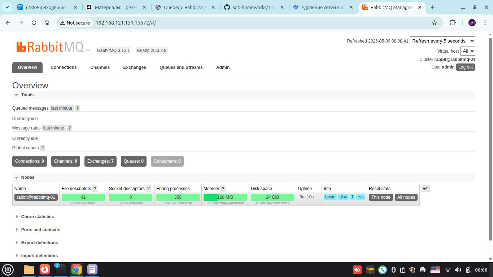

---

## Задание 2. Отправка и получение сообщений

Используя приложенные скрипты, проведите тестовую отправку и получение сообщения. Для отправки сообщений необходимо запустить скрипт producer.py.

Для работы скриптов вам необходимо установить Python версии 3 и библиотеку Pika. Также в скриптах нужно указать IP-адрес машины, на которой запущен RabbitMQ, заменив localhost на нужный IP.

Зайдите в веб-интерфейс, найдите очередь под названием hello и сделайте скриншот. После чего запустите второй скрипт consumer.py и сделайте скриншот результата выполнения скрипта

В качестве решения домашнего задания приложите оба скриншота, сделанных на этапе выполнения.

Для закрепления материала можете попробовать модифицировать скрипты, чтобы поменять название очереди и отправляемое сообщение.

### Решение

прописываем и запускаем скрипт producer.py


```python

#!/usr/bin/env python3
# producer.py
import pika

connection = pika.BlockingConnection(pika.ConnectionParameters('192.168.121.151'))
channel = connection.channel()
channel.queue_declare(queue='hello')
channel.basic_publish(exchange='', routing_key='hello', body='Hello Netology!')
print(" [x] Sent 'Hello Netology!'")
connection.close()

```

прописываем и запускаем скрипт consumer.py

```python

#!/usr/bin/env python3
# consumer.py
import pika

def callback(ch, method, properties, body):
    print(f" [x] Received {body.decode()}")

connection = pika.BlockingConnection(pika.ConnectionParameters(192.168.121.151''))
channel = connection.channel()
channel.queue_declare(queue='hello')
channel.basic_consume(queue='hello', on_message_callback=callback, auto_ack=True)

print(' [*] Waiting for messages. To exit press CTRL+C')
channel.start_consuming() 

```

Скриншоты результата работы скриптов

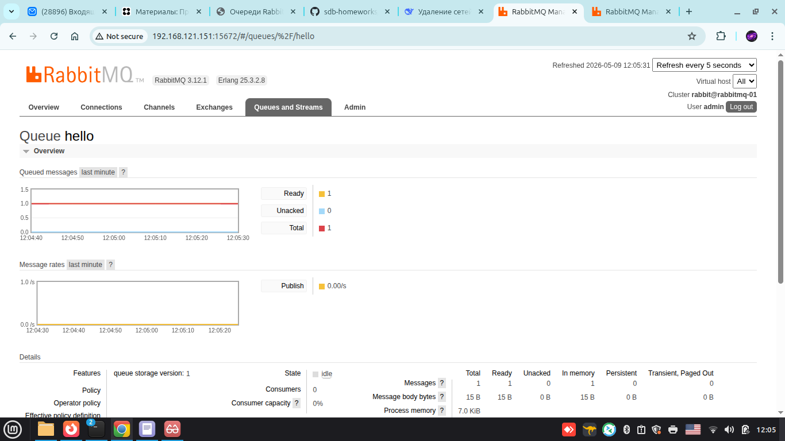

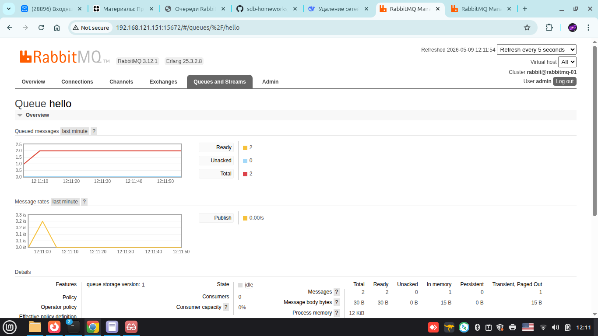

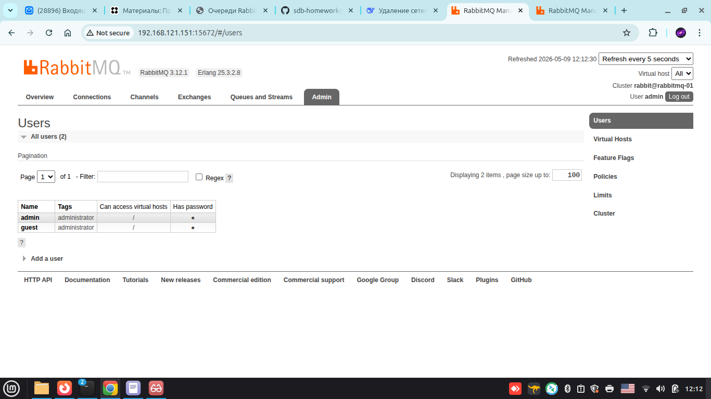

 на третьем скриншоте видно пользователей.

####  Таким же образом создадим второй сервер, пропишем скрипты 

####  Модифицируем.

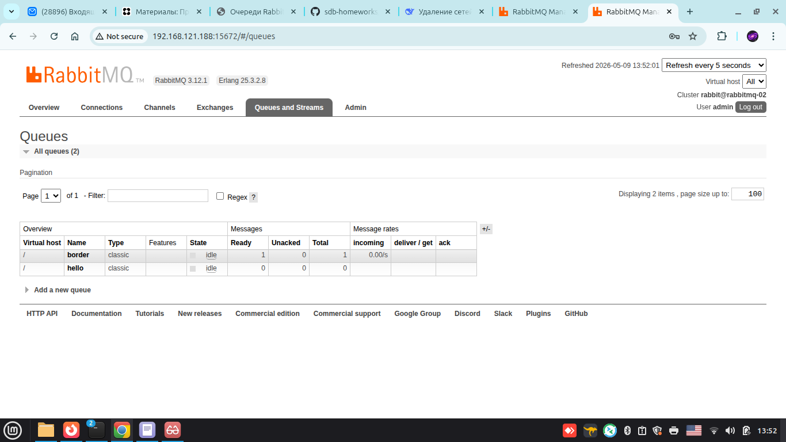

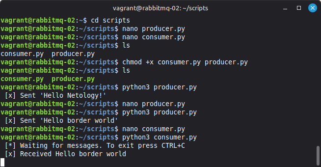

---

## Задание 3. Подготовка HA кластера

Используя Vagrant или VirtualBox, создайте вторую виртуальную машину 
и установите RabbitMQ. Добавьте в файл hosts название и IP-адрес каждой машины,
 чтобы машины могли видеть друг друга по имени.
Затем объедините две машины в кластер и создайте политику ha-all на все очереди.
Также приложите вывод команды с двух нод:

```bash
rabbitmqctl cluster_status
```

Для закрепления материала снова запустите скрипт producer.py
 и приложите скриншот выполнения команды на каждой из нод:

```bash
rabbitmqadmin get queue='hello'
```

### Решение

Добавили в /etc/hosts адреса машин кластера

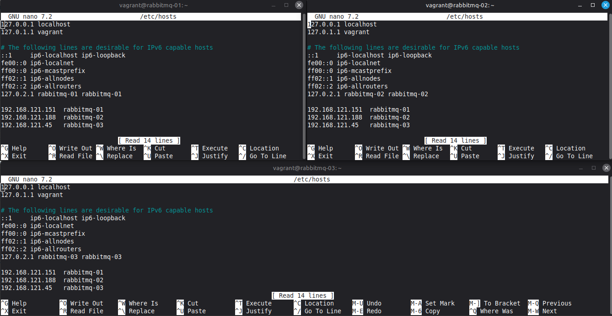

пропинговали по именам

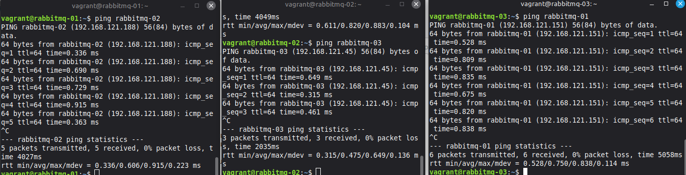

После настройки /etc/hosts на всех машинах и установки правильных hostname,
 можно собирать кластер командой (на rabbitmq-02) (rabbit-03)

```
sudo rabbitmqctl stop_app
sudo rabbitmqctl reset
sudo rabbitmqctl join_cluster rabbit@rabbitmq-01
sudo rabbitmqctl start_app
```
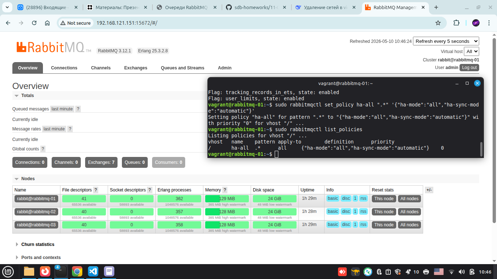

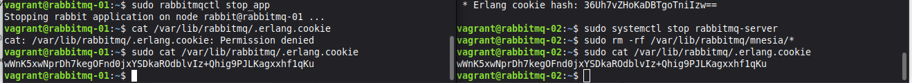

выполним скрипт producer.py на одном из серверов
затем проверим на всех очередь

```bash
rabbitmqadmin get queue='hello'
```

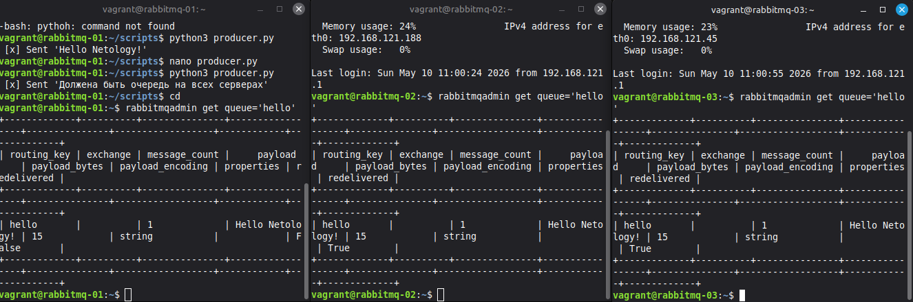

---
---

дополнительное задание 

###  Задание 4. Ansible playbook

Напишите плейбук, который будет производить установку RabbitMQ на любое количество нод и объединять их в кластер. При этом будет автоматически создавать политику ha-all.

#### Решение

Пропишем роль для установки RabbitMQ 

планируем архитектуру Роли

```
ansible-role-rabbitmq-cluster/
.
├── defaults/
│   └── main.yml          # переменные по умолчанию
├── vars/
│   └── main.yml          # переменные, которые не должны переопределяться
├── tasks/
│   ├── main.yml          # точка входа
│   ├── install.yml
│   ├── configure.yml
│   ├── cluster.yml
│   └── policy.yml
├── handlers/
│   └── main.yml          # restart rabbitmq-server
├── templates/
│   ├── rabbitmq-env.conf.j2
│   └── hosts.j2          # /etc/hosts (если нужно)
├── files/
│   └── (пусто, но можно для .erlang.cookie)
└── meta/
    └── main.yml          # зависимости и информация о роли

```

Прописываем все файлы и запускаем плейбук.

- [role-rabbit](HW-11-04/ansible-role-rabbitmq-cluster/)

командой

```
ansible-playbook -i inventory/hosts site.yml

```


скриншот статуса кластера

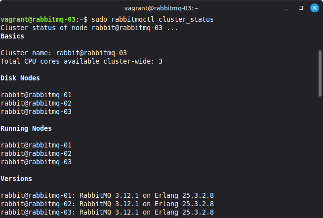

скриншот пинга машин -m ping (ansible)

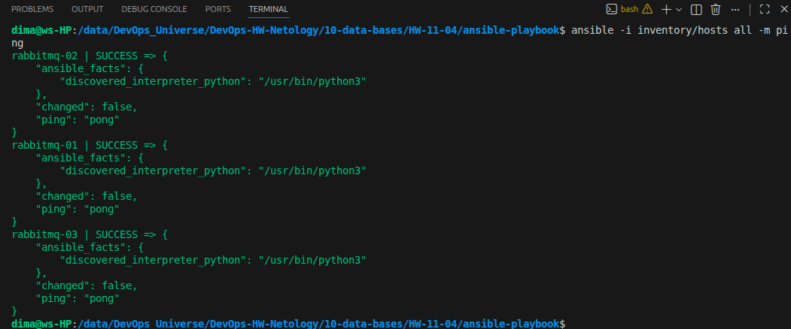

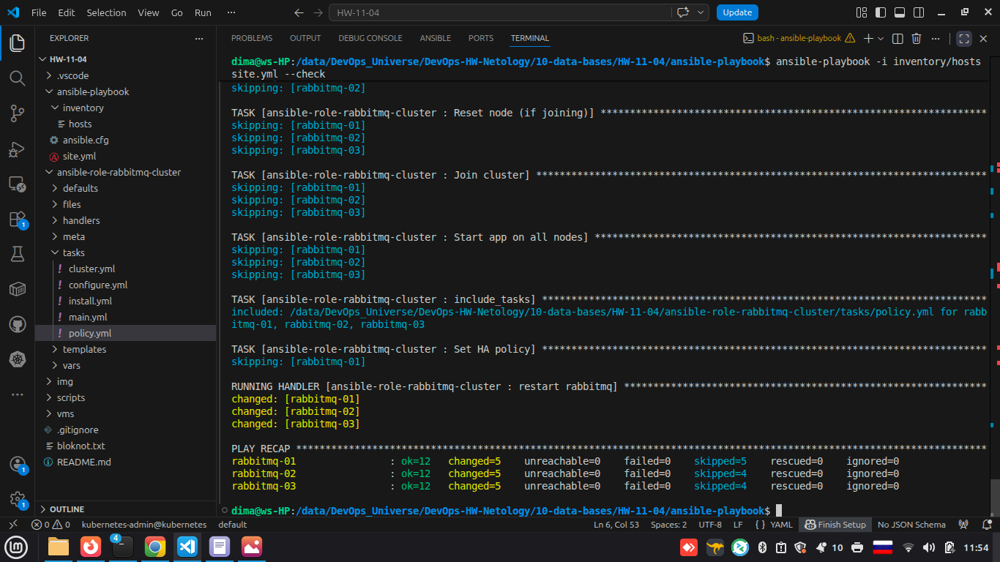

Скриншот web интерфейса кластера

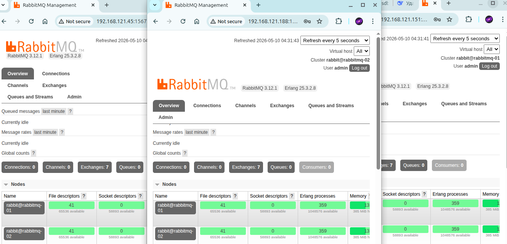

---
---
---
10.05.2026г.


